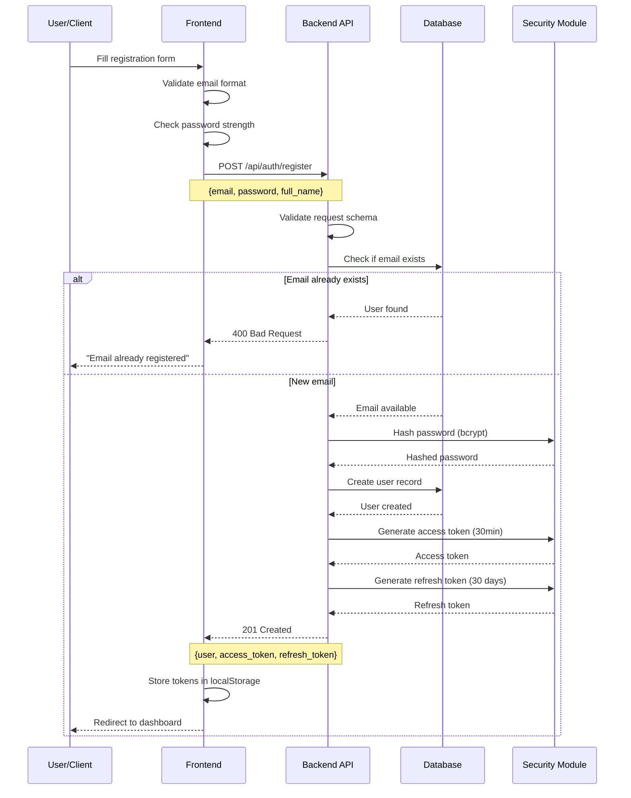
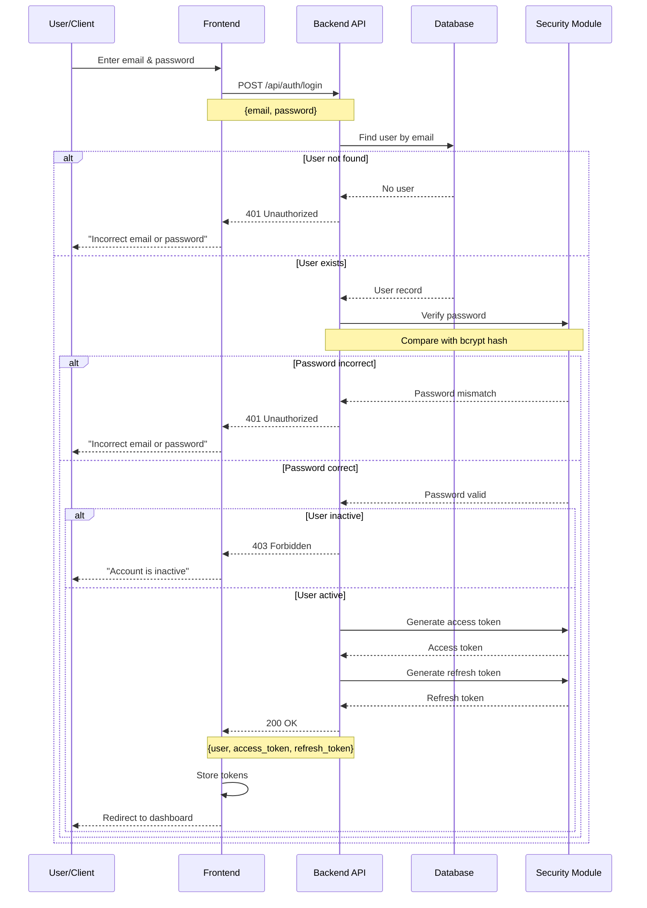
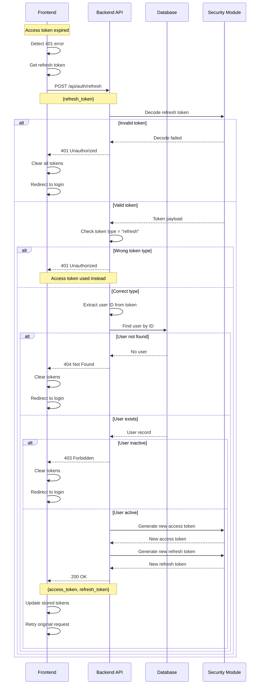
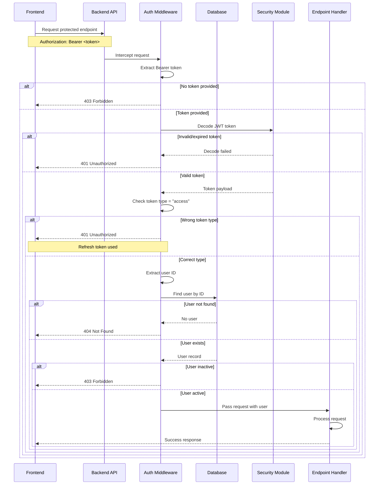
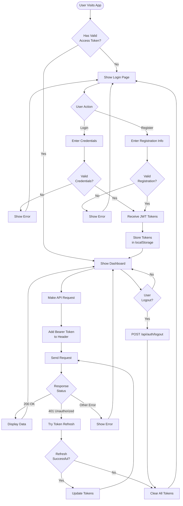
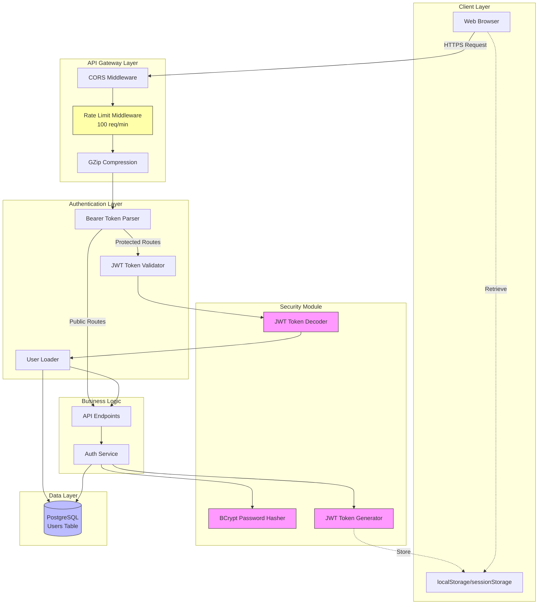
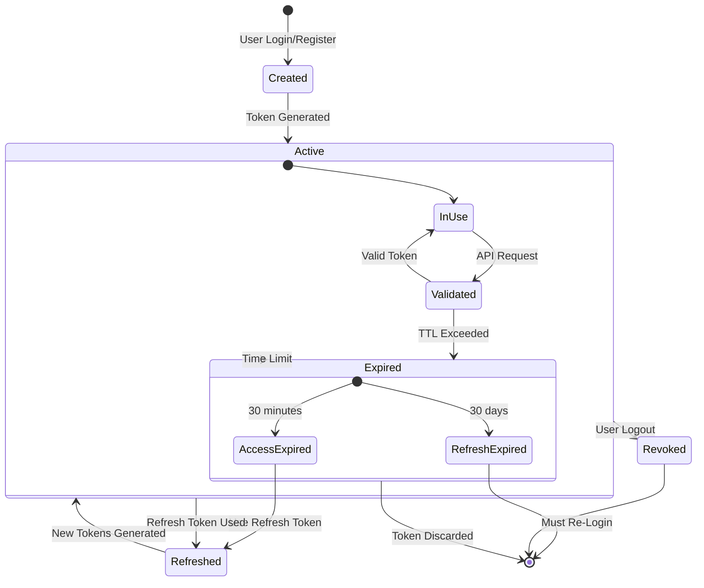
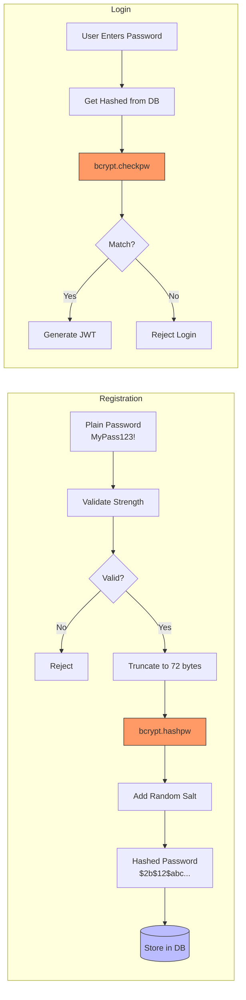
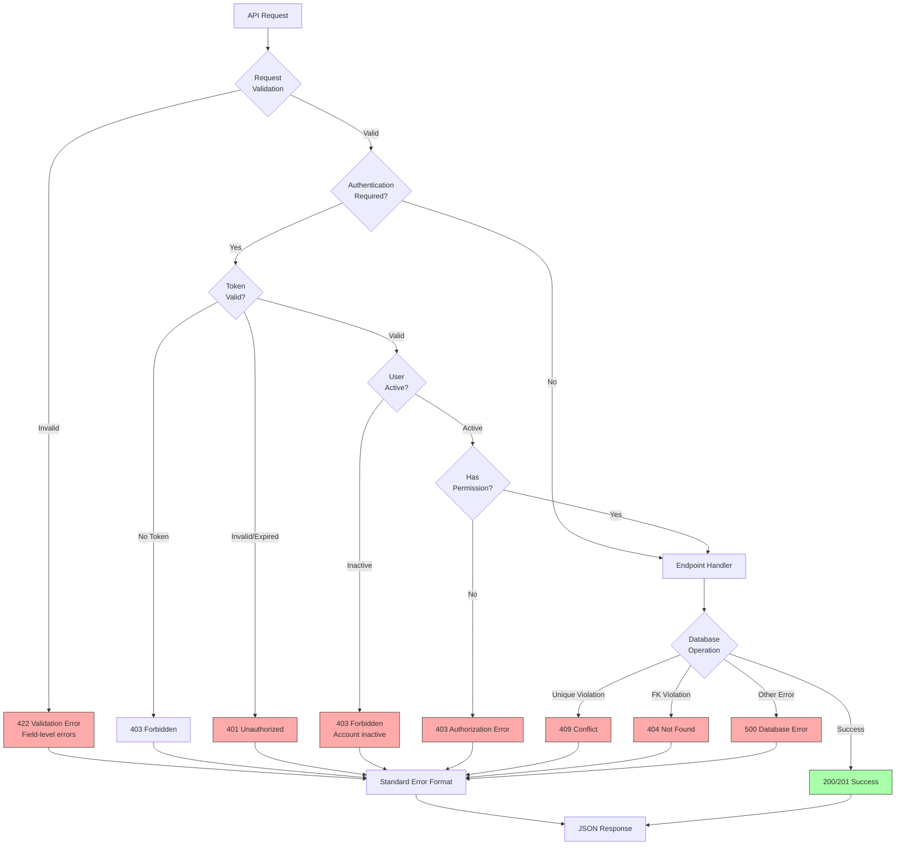

# Authentication Flow Diagrams

## Registration Flow

## Login Flow

## Token Refresh Flow

## Protected Endpoint Access

## Complete User Journey

## Security Architecture

## Token Lifecycle

## Password Security Flow

## Error Handling Flow

